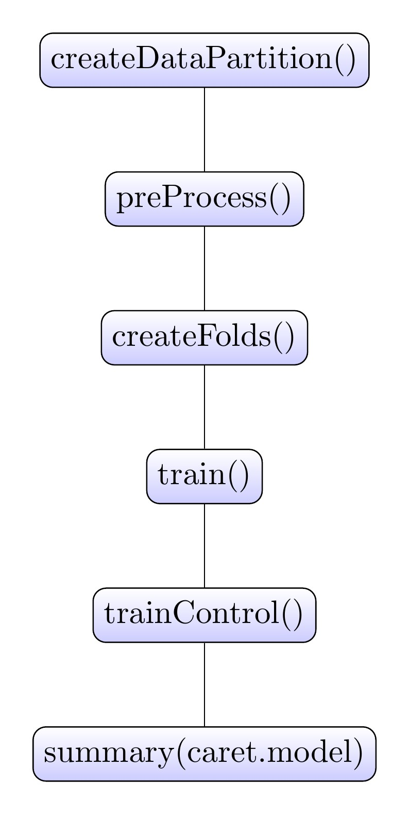
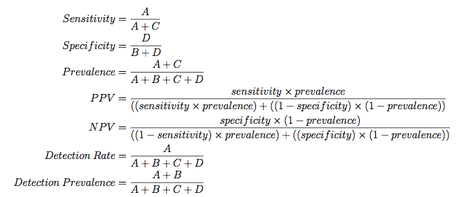

<!-- Limit image width and height -->
<style type='text/css'>
img {
    max-height: 540px;
    max-width: 964px;
}
</style>

<!-- Center image on slide -->
<script src="http://ajax.aspnetcdn.com/ajax/jQuery/jquery-1.7.min.js"></script>
<script type='text/javascript'>
$(function() {
    $("p:has(img)").addClass('centered');
});
</script>

## What is Caret

- Classification And REgression Training
- Meta language for uniform model building framework
- Algorithmically break down model building process

--- &twocol

## Data Workflow 

*** =left

 

*** =right
_

--- &twocol

## Data Workflow With caret

*** =left

 

*** =right

 

---

## Cut Data

Want to create test and train set:
- Need unseen data in order to evaluate model on new data
- Can easily bias through bad splitting
- createDataPartition()

---

### Ex: Split into test and train

```{r startSplit,cache=TRUE,message=FALSE,warning=FALSE}
library(caret)
library(randomForest)
etitanic <- read.csv("TrainTitanic.csv",header=TRUE)
etitanic$Cabin <- substr(etitanic$Cabin, 1, 1)
etitanic[which(etitanic$Cabin == ""),"Cabin"] <- "No.Cabin"
etitanic$Cabin <- factor(etitanic$Cabin)
etitanic$Survived <- factor(etitanic$Survived, levels = c(0,1),labels = c("Dead","Alive"))
table(etitanic$Survived)

```

---

### Why not just use sample()?
```{r sampleBad}
set.seed(4334)
x <- rep(0,100)
x[c(1,4,8,9,14)] <- 1
x
sample(x,30)

```

---

### Data Partition
```{r datapart,cache=TRUE}
index <- createDataPartition(etitanic$Survived, 
                             p = 0.8, # Percent of data that goes into training
                             list = FALSE, # do not return a list
) 
ytrain <- etitanic[index,"Survived"]
ytest <- etitanic[-index,"Survived"]
train <- etitanic[index,-2]
test <- etitanic[-index,-2]
```

---


### Ex: Split into test and train

```{r splitTest,cache=TRUE,comment=NA,echo=FALSE }
list(table(ytrain),table(ytest))
```

---

### Ex: Split into test and train

```{r splitTrain,cache=TRUE,comment=NA,echo=FALSE}
str(train)
```

---
## Preprocess

- Data IRL is going to be gross/bad
- Want to maintain charateristics in train/test
- Models need assumptions to exist in data


---

## The Meat: Preprocess()

- "Meatest Method" = method
- Possible values are "BoxCox",
"YeoJohnson", "expoTrans", "center", "scale", "range", "knnImpute", "bagImpute",
"medianImpute", "pca", "ica", "spatialSign", "zv", "nzv", and "conditionalX"

 
---

### EX: Preprocess()


```{r preProcess1,comment=NA}
preProcValues <- preProcess(train[,c("Fare","Age")],
                            method = c("center", "scale","BoxCox","expoTrans"))


trainTrans <- predict(preProcValues, train)
testTrans <- predict(preProcValues, test)
```

--- &twocol

## Data Workflow 

*** =left

```{r beforetrans}
plot(density(train$Fare))
```

*** =right
```{r aftertrans}
plot(density(trainTrans$Fare))
```

---

### Ex: Preprocess - Dummies

```{r dummyVar,comment=NA}
dummies <- dummyVars(~ ., data = train)
train <- predict(dummies, newdata = train)
test <- predict(dummies,newdata = test)
dim(train)
table(train[,"Ticket.STON/O2. 3101279"])
```

```{r dummyVarTran,comment=NA,echo=FALSE}
dummies <- dummyVars(~ ., data = trainTrans)
trainTrans <- predict(dummies, newdata = trainTrans)
testTrans <- predict(dummies,newdata = testTrans)


```

---

## We need to get rid of Near Zero Variance Predictors

- Predictors with only one value (Sally G. Wentworth)
- percentUnique: Predictors with very few unique values relative to the sample
- freqRatio: Ratio of the frequency of most common value to second most common

---

### Ex: Preprocess - NZV

```{r nzvShow,comment=NA}
nzv <- nearZeroVar(train, saveMetrics= TRUE)
head(nzv)
```

---

### Ex: Preprocess - NZV
```{r nzvAct}
nzv <- nearZeroVar(train)
train <- train[,-nzv]
test <- test[,-nzv]
dim(train)
```

```{r nzvAct2,echo=FALSE}
nzv <- nearZeroVar(trainTrans)
trainTrans <- trainTrans[,-nzv]
testTrans <- testTrans[,-nzv]
dim(train)
```

---

### Ex: Preprocess - Linear Combinations

```{r,comment=NA,eval=FALSE}
comboInfo <- findLinearCombos(trainTrans)
colnames(trainTrans)[comboInfo$remove]
if (length(colnames(train)[comboInfo$remove])!=0 &&
    !is.character(colnames(train)[comboInfo$remove]) ){
  train <- train[, -comboInfo$remove]
}
```

---

## Some things to know

 

 

---

## Feature Importance

```{r featureSelect}
 rfctrl <- rfeControl(functions = rfFuncs, 
                      method = "cv", 
                      number = 10)
 trainTransprof <- trainTrans[complete.cases(trainTrans),]
 ytrainprof <- ytrain[complete.cases(trainTrans)]
  rfprofile <- rfe( trainTransprof , ytrainprof,
                   sizes = c(2:13),
                   rfeControl = rfctrl)
```

---

```{r featurepresent,comment = NA}
rfprofile$results
rfprofile$optVariables
```

---

### Our Model: C5.0

- I like it
- Pretty cool
- Heuristic Explenation
- See Max Kuhns book, "Applied Predictive Modeling"

---

### Putting it all together with train()

```{r c50Fit1,warning=FALSE,message=FALSE}
c50Fit1 <- train(x = train, y = ytrain,
                  method = "C5.0",
                  metric = "ROC",
                  trControl = trainControl(method = "cv",
                                           number = 10,
                                           summaryFunction = twoClassSummary,
                                           classProbs = TRUE),
                  tuneGrid = expand.grid(trials = c(1:10)*4,
                                         model = c("rules","tree"),
                                         winnow = c(FALSE,TRUE)))
```

---

## Model Tuning: tuneGrid

- Searches grid of possible tuning values
- Gives back best model parameters

---


### expand.grid is great
```{r grid}
 c50Grid <- expand.grid(trials = c(1:20)*4,
                        model = c("rules","tree"),
                        winnow = c(FALSE,TRUE))
c50Grid[sample.int(40,5),]

```


---

### Plotting Grid

```{r c50wire}
wireframe(ROC~trials * (as.numeric(winnow)+as.numeric(model)), data = c50Fit1$results,
          xlab = "Trials", ylab = "Winnowing + Model", main = "C50 Tuning Grid",
          drape = TRUE, colorkey = TRUE, screen = list(z = 40, x = -70),
          zlab = list("ROC", rot = 90))
          
```

---

### Model Evaluation

```{r c50eval1}
xx <- c50Fit1$bestTune
subset(c50Fit1$results,trials == xx[[1]] & model == xx[[2]] & winnow == xx[[3]])
```


---

### Plotting Model Eval

```{r c50eval666}
plot(c50Fit1)
```

---

### Control Function

```{r control11 }
#
  fitControl <- trainControl(## 10-fold CV
   method = "cv",
   number = 10,
   summaryFunction = twoClassSummary,
   classProbs = TRUE)
   
```


---

### Model Evaluation

```{r c50eval1b}
#
 testPred <- predict(c50Fit1, test)
 confusionMatrix(testPred, ytest)$table
```

---

### Trying again

# With preprocessed data
```{r c50Fit2,warning=FALSE}
 c50Fit2 <- train(x = trainTrans, y = ytrain,
                  method = "C5.0",
                  metric = "ROC",
                  trControl = fitControl,
                  tuneGrid = c50Grid)
```

---

```{r c50wire2}
plot(c50Fit2)
```

---

### Model Evaluation

```{r c50eval2}
xx <- c50Fit2$bestTune
subset(c50Fit2$results,trials == xx[[1]] & model == xx[[2]] & winnow == xx[[3]])
```


---

### Model Evaluation

```{r c50eval2b}
testPred <- predict(c50Fit2, testTrans)
 confusionMatrix(testPred, ytest)$table
```

---

## What about big models?

- Need to do things in parallel
- doMC from Revolution R makes it easy

---

## Parallel Processing Example

- You need to sum a list of 1000 numbers
- Cut that into 10 lists of 100 numbers
- Hand to 10 of your friends to sum each list
- They give you back 10 numbers to sum

---

```{r gbmstuff1}
 gbmGrid <-  expand.grid(interaction.depth = c(6:10),
                         n.trees = (5:10)*50,
                         shrinkage = c(20:25)*.001,
                         n.minobsinnode = c(20:25))
dim(gbmGrid)
```

---

```{r gbmstuff2}
fitControl <- trainControl(## 10-fold CV
   method = "cv",
   number = 10,
   summaryFunction = twoClassSummary,
   classProbs = TRUE,
   allowParallel = TRUE)
```

---

```{r gbmstuff3,cache=TRUE}
library(doMC)
registerDoMC(cores = 3)

# Do not run this
gbmFit2 <- train(x= trainTrans, y = ytrain,
                  method = "gbm",
                  trControl = fitControl,
                  verbose = FALSE,
                  metric= "ROC",
                  tuneGrid = gbmGrid)
``` 

---

```{r gbmstuff4}
testPred <- predict(gbmFit2, testTrans)
confusionMatrix(testPred, ytest)$table
xx <- gbmFit2$bestTune
subset(gbmFit2$results,n.trees == xx[[1]] & interaction.depth == xx[[2]] &
         shrinkage == xx[[3]] & n.minobsinnode == xx[[4]])
```

---

```{r gbmplott}
plot(gbmFit2)
```

---

```{r gbmplot2}
wireframe(ROC~n.trees + (interaction.depth + shrinkage + n.minobsinnode), data = gbmFit2$results,
          xlab = "n.trees", ylab = "interaction.depth + shrinkage + n.minobsinnode", main = "GBM Tuning Grid",
          drape = TRUE, colorkey = TRUE, screen = list(z = 40, x = -70),
          zlab = list("ROC", rot = 90))
```

---

## Can we mush models together and get something better?

- Ensembling commonly wins Kaggle Competitions
- Betting on the average

---

```{r ensemble1,message = FALSE, warning = FALSE}
 library(caretEnsemble)
 
 my_control <- trainControl(
   method="cv",
   number=10,
   savePredictions="all",
   classProbs=TRUE,
   index=createFolds(ytrain, 10),
   summaryFunction=twoClassSummary
 )
```

---

```{r ensemble2, message = FALSE, warning = FALSE, cache = TRUE}
 model_list_big <- caretList(x = trainTrans,
                             y = ytrain,
                             trControl=my_control,
                             metric="ROC",
                             methodList=c("rpart"),
                             tuneList=list(
                               c50=caretModelSpec(method="C5.0",
                                                  tuneGrid=c50Grid))
   )

 
```


---

## Ensemlble Correlation
```{r ensemble3}
modCorr <- modelCor(resamples(model_list_big))
modCorr
```

---

```{r ensemble5}
rf_ensemble <- caretStack(
   model_list_big,
   method="rf",
   metric="ROC",
   trControl=trainControl(
     method="cv",
     number=10,
     savePredictions="final",
     classProbs=TRUE,
     summaryFunction=twoClassSummary
   )
 )
```

---
  

```{r ensemble4}
 model_preds <- predict(rf_ensemble, newdata=testTrans)
 confusionMatrix(model_preds, ytest)$table
```

---

### Using Final Test Data

```{r testTitanic1}

testFinal <- read.csv("TestTitanic.csv")
submission <- data.frame(PassengerId = testFinal$PassengerId)

testFinal$Cabin <- substr(testFinal$Cabin, 1, 1)
testFinal[which(testFinal$Cabin == ""),"Cabin"] <- "No.Cabin"
testFinal$Cabin <- factor(testFinal$Cabin)
```

---

```{r testTitanic2}
testFinalTrans <- predict(preProcValues, testFinal)
testFinalTrans <- predict(dummies,newdata = testFinal)

testFinal <- predict(dummies,newdata = testFinal)
colnames(testFinalTrans)[which(colnames(testFinalTrans) == "Cabin.No.Cabin")] <- c("Cabin.")
submission$Survived <- as.numeric(predict(c50Fit2, testFinalTrans)) - 1
write.csv(submission, file = "c50Fit2_submission.csv", row.names=FALSE)

submission$Survived <- as.numeric(predict(gbmFit2, testFinalTrans)) - 1
write.csv(submission, file = "gbmFit2_submission.csv", row.names=FALSE)

```

