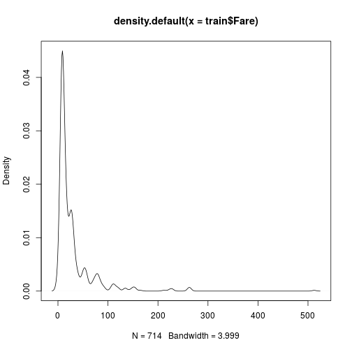
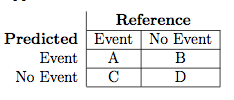
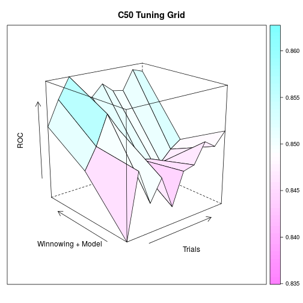
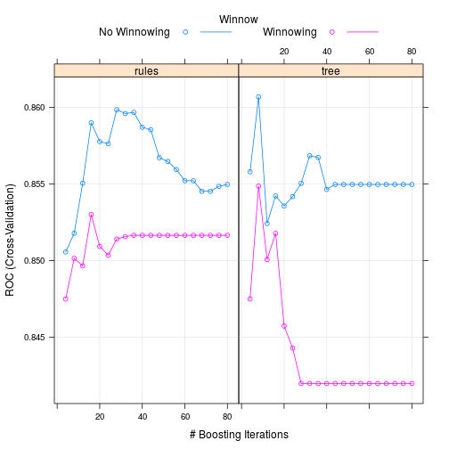

<!-- Limit image width and height -->
<style type='text/css'>
img {
    max-height: 540px;
    max-width: 964px;
}
</style>

<!-- Center image on slide -->
<script src="http://ajax.aspnetcdn.com/ajax/jQuery/jquery-1.7.min.js"></script>
<script type='text/javascript'>
$(function() {
    $("p:has(img)").addClass('centered');
});
</script>

## What is Caret

- Classification And REgression Training
- Meta language for uniform model building framework
- Algorithmically break down model building process

--- &twocol

## Data Workflow 

*** =left

 

*** =right
_

--- &twocol

## Data Workflow With caret

*** =left

 

*** =right

 

---

## Cut Data

Want to create test and train set:
- Need unseen data in order to evaluate model on new data
- Can easily bias through bad splitting
- createDataPartition()

---

### Ex: Split into test and train


```r
library(caret)
library(randomForest)
etitanic <- read.csv("TrainTitanic.csv",header=TRUE)
etitanic$Cabin <- substr(etitanic$Cabin, 1, 1)
etitanic[which(etitanic$Cabin == ""),"Cabin"] <- "No.Cabin"
etitanic$Cabin <- factor(etitanic$Cabin)
etitanic$Survived <- factor(etitanic$Survived, levels = c(0,1),labels = c("Dead","Alive"))
table(etitanic$Survived)
```

```
## 
##  Dead Alive 
##   549   342
```

---

### Why not just use sample()?

```r
set.seed(4334)
x <- rep(0,100)
x[c(1,4,8,9,14)] <- 1
x
```

```
##   [1] 1 0 0 1 0 0 0 1 1 0 0 0 0 1 0 0 0 0 0 0 0 0 0 0 0 0 0 0 0 0 0 0 0 0 0
##  [36] 0 0 0 0 0 0 0 0 0 0 0 0 0 0 0 0 0 0 0 0 0 0 0 0 0 0 0 0 0 0 0 0 0 0 0
##  [71] 0 0 0 0 0 0 0 0 0 0 0 0 0 0 0 0 0 0 0 0 0 0 0 0 0 0 0 0 0 0
```

```r
sample(x,30)
```

```
##  [1] 0 0 0 0 0 0 0 0 0 0 0 0 0 0 0 0 0 0 0 0 0 0 0 0 0 0 0 0 0 0
```

---

### Data Partition

```r
index <- createDataPartition(etitanic$Survived, 
                             p = 0.8, # Percent of data that goes into training
                             list = FALSE, # do not return a list
) 
ytrain <- etitanic[index,"Survived"]
ytest <- etitanic[-index,"Survived"]
train <- etitanic[index,-2]
test <- etitanic[-index,-2]
```

---


### Ex: Split into test and train


```
[[1]]
ytrain
 Dead Alive 
  440   274 

[[2]]
ytest
 Dead Alive 
  109    68 
```

---

### Ex: Split into test and train


```
'data.frame':	714 obs. of  11 variables:
 $ PassengerId: int  1 2 3 4 5 6 7 8 9 10 ...
 $ Pclass     : int  3 1 3 1 3 3 1 3 3 2 ...
 $ Name       : Factor w/ 891 levels "Abbing, Mr. Anthony",..: 109 191 358 277 16 559 520 629 416 581 ...
 $ Sex        : Factor w/ 2 levels "female","male": 2 1 1 1 2 2 2 2 1 1 ...
 $ Age        : num  22 38 26 35 35 NA 54 2 27 14 ...
 $ SibSp      : int  1 1 0 1 0 0 0 3 0 1 ...
 $ Parch      : int  0 0 0 0 0 0 0 1 2 0 ...
 $ Ticket     : Factor w/ 681 levels "110152","110413",..: 525 596 662 50 473 276 86 396 345 133 ...
 $ Fare       : num  7.25 71.28 7.92 53.1 8.05 ...
 $ Cabin      : Factor w/ 9 levels "A","B","C","D",..: 8 3 8 3 8 8 5 8 8 8 ...
 $ Embarked   : Factor w/ 4 levels "","C","Q","S": 4 2 4 4 4 3 4 4 4 2 ...
```

---
## Preprocess

- Data IRL is going to be gross/bad
- Want to maintain charateristics in train/test
- Models need assumptions to exist in data


---

## The Meat: Preprocess()

- "Meatest Method" = method
- Possible values are "BoxCox",
"YeoJohnson", "expoTrans", "center", "scale", "range", "knnImpute", "bagImpute",
"medianImpute", "pca", "ica", "spatialSign", "zv", "nzv", and "conditionalX"

 
---

### EX: Preprocess()


```r
preProcValues <- preProcess(train[,c("Fare","Age")],
                            method = c("center", "scale","BoxCox","expoTrans"))


trainTrans <- predict(preProcValues, train)
testTrans <- predict(preProcValues, test)
```

--- &twocol

## Data Workflow 

*** =left


```r
plot(density(train$Fare))
```

 

*** =right

```r
plot(density(trainTrans$Fare))
```

 

---

### Ex: Preprocess - Dummies


```r
dummies <- dummyVars(~ ., data = train)
train <- predict(dummies, newdata = train)
test <- predict(dummies,newdata = test)
dim(train)
```

```
[1]  714 1593
```

```r
table(train[,"Ticket.STON/O2. 3101279"])
```

```

  0   1 
713   1 
```


---

## We need to get rid of Near Zero Variance Predictors

- Predictors with only one value (Sally G. Wentworth)
- percentUnique: Predictors with very few unique values relative to the sample
- freqRatio: Ratio of the frequency of most common value to second most common

---

### Ex: Preprocess - NZV


```r
nzv <- nearZeroVar(train, saveMetrics= TRUE)
head(nzv)
```

```
                                       freqRatio percentUnique zeroVar
PassengerId                             1.000000   100.0000000   FALSE
Pclass                                  2.352941     0.4201681   FALSE
Name.Abbing, Mr. Anthony              713.000000     0.2801120   FALSE
Name.Abbott, Mr. Rossmore Edward        0.000000     0.1400560    TRUE
Name.Abbott, Mrs. Stanton (Rosa Hunt) 713.000000     0.2801120   FALSE
Name.Abelson, Mr. Samuel              713.000000     0.2801120   FALSE
                                        nzv
PassengerId                           FALSE
Pclass                                FALSE
Name.Abbing, Mr. Anthony               TRUE
Name.Abbott, Mr. Rossmore Edward       TRUE
Name.Abbott, Mrs. Stanton (Rosa Hunt)  TRUE
Name.Abelson, Mr. Samuel               TRUE
```

---

### Ex: Preprocess - NZV

```r
nzv <- nearZeroVar(train)
train <- train[,-nzv]
test <- test[,-nzv]
dim(train)
```

```
## [1] 714  14
```


```
## [1] 714  14
```

---

### Ex: Preprocess - Linear Combinations


```r
comboInfo <- findLinearCombos(trainTrans)
colnames(trainTrans)[comboInfo$remove]
if (length(colnames(train)[comboInfo$remove])!=0 &&
    !is.character(colnames(train)[comboInfo$remove]) ){
  train <- train[, -comboInfo$remove]
}
```

---

## Some things to know

 

 

---

## Feature Importance


```r
 rfctrl <- rfeControl(functions = rfFuncs, 
                      method = "cv", 
                      number = 10)
 trainTransprof <- trainTrans[complete.cases(trainTrans),]
 ytrainprof <- ytrain[complete.cases(trainTrans)]
  rfprofile <- rfe( trainTransprof , ytrainprof,
                   sizes = c(2:13),
                   rfeControl = rfctrl)
```

---


```r
rfprofile$results
```

```
   Variables  Accuracy     Kappa AccuracySD    KappaSD
1          2 0.7807018 0.5290439 0.04472824 0.09639137
2          3 0.7894737 0.5558118 0.04678363 0.09518625
3          4 0.8000000 0.5702758 0.03807911 0.08305862
4          5 0.8052632 0.5818258 0.03918565 0.08956240
5          6 0.8245614 0.6246790 0.03308102 0.06930706
6          7 0.8157895 0.6053460 0.03121953 0.06648998
7          8 0.8245614 0.6252737 0.03698570 0.07762233
8          9 0.8192982 0.6132189 0.04221072 0.09132594
9         10 0.8192982 0.6125347 0.04221072 0.08945815
10        11 0.8192982 0.6134942 0.04754497 0.10175326
11        12 0.8140351 0.6034660 0.04692960 0.10133317
12        13 0.8105263 0.5961178 0.04514680 0.09666723
```

```r
rfprofile$optVariables
```

```
[1] "Sex.male"       "Sex.female"     "Pclass"         "Age"           
[5] "SibSp"          "Cabin.No.Cabin"
```

---

### Our Model: C5.0

- I like it
- Pretty cool
- Heuristic Explenation
- See Max Kuhns book, "Applied Predictive Modeling"

---

### Putting it all together with train()


```r
c50Fit1 <- train(x = train, y = ytrain,
                  method = "C5.0",
                  metric = "ROC",
                  trControl = trainControl(method = "cv",
                                           number = 10,
                                           summaryFunction = twoClassSummary,
                                           classProbs = TRUE),
                  tuneGrid = expand.grid(trials = c(1:10)*4,
                                         model = c("rules","tree"),
                                         winnow = c(FALSE,TRUE)))
```

---

## Model Tuning: tuneGrid

- Searches grid of possible tuning values
- Gives back best model parameters

---


### expand.grid is great

```r
 c50Grid <- expand.grid(trials = c(1:20)*4,
                        model = c("rules","tree"),
                        winnow = c(FALSE,TRUE))
c50Grid[sample.int(40,5),]
```

```
##    trials model winnow
## 23     12  tree  FALSE
## 12     48 rules  FALSE
## 17     68 rules  FALSE
## 29     36  tree  FALSE
## 16     64 rules  FALSE
```


---

### Plotting Grid


```r
wireframe(ROC~trials * (as.numeric(winnow)+as.numeric(model)), data = c50Fit1$results,
          xlab = "Trials", ylab = "Winnowing + Model", main = "C50 Tuning Grid",
          drape = TRUE, colorkey = TRUE, screen = list(z = 40, x = -70),
          zlab = list("ROC", rot = 90))
```

 

---

### Model Evaluation


```r
xx <- c50Fit1$bestTune
subset(c50Fit1$results,trials == xx[[1]] & model == xx[[2]] & winnow == xx[[3]])
```

```
##    model winnow trials       ROC      Sens      Spec      ROCSD     SensSD
## 33  tree   TRUE     12 0.8610465 0.9045455 0.6966931 0.05294011 0.03979977
##        SpecSD
## 33 0.09847575
```


---

### Plotting Model Eval


```r
plot(c50Fit1)
```

 

---

### Control Function


```r
#
  fitControl <- trainControl(## 10-fold CV
   method = "cv",
   number = 10,
   summaryFunction = twoClassSummary,
   classProbs = TRUE)
```


---

### Model Evaluation


```r
#
 testPred <- predict(c50Fit1, test)
 confusionMatrix(testPred, ytest)$table
```

```
##           Reference
## Prediction Dead Alive
##      Dead    92    21
##      Alive   17    47
```

---

### Trying again

# With preprocessed data

```r
 c50Fit2 <- train(x = trainTrans, y = ytrain,
                  method = "C5.0",
                  metric = "ROC",
                  trControl = fitControl,
                  tuneGrid = c50Grid)
```

---


```r
plot(c50Fit2)
```

 

---

### Model Evaluation


```r
xx <- c50Fit2$bestTune
subset(c50Fit2$results,trials == xx[[1]] & model == xx[[2]] & winnow == xx[[3]])
```

```
##    model winnow trials       ROC      Sens      Spec      ROCSD     SensSD
## 42  tree  FALSE      8 0.8606812 0.9068182 0.6933862 0.04878892 0.02501148
##        SpecSD
## 42 0.08955894
```


---

### Model Evaluation


```r
testPred <- predict(c50Fit2, testTrans)
 confusionMatrix(testPred, ytest)$table
```

```
##           Reference
## Prediction Dead Alive
##      Dead    94    22
##      Alive   15    46
```

---

## What about big models?

- Need to do things in parallel
- doMC from Revolution R makes it easy

---

## Parallel Processing Example

- You need to sum a list of 1000 numbers
- Cut that into 10 lists of 100 numbers
- Hand to 10 of your friends to sum each list
- They give you back 10 numbers to sum

---


```r
 gbmGrid <-  expand.grid(interaction.depth = c(6:10),
                         n.trees = (5:10)*50,
                         shrinkage = c(20:25)*.001,
                         n.minobsinnode = c(20:25))
dim(gbmGrid)
```

```
## [1] 1080    4
```

---


```r
fitControl <- trainControl(## 10-fold CV
   method = "cv",
   number = 10,
   summaryFunction = twoClassSummary,
   classProbs = TRUE,
   allowParallel = TRUE)
```

---


```r
library(doMC)
```

```
## Loading required package: foreach
## foreach: simple, scalable parallel programming from Revolution Analytics
## Use Revolution R for scalability, fault tolerance and more.
## http://www.revolutionanalytics.com
## Loading required package: iterators
## Loading required package: parallel
```

```r
registerDoMC(cores = 3)

# Do not run this
gbmFit2 <- train(x= trainTrans, y = ytrain,
                  method = "gbm",
                  trControl = fitControl,
                  verbose = FALSE,
                  metric= "ROC",
                  tuneGrid = gbmGrid)
```

```
## Loading required package: gbm
## Loading required package: survival
## 
## Attaching package: 'survival'
## 
## The following object is masked from 'package:caret':
## 
##     cluster
## 
## Loading required package: splines
## Loaded gbm 2.1.1
```

---


```r
testPred <- predict(gbmFit2, testTrans)
confusionMatrix(testPred, ytest)$table
```

```
##           Reference
## Prediction Dead Alive
##      Dead    94    22
##      Alive   15    46
```

```r
xx <- gbmFit2$bestTune
subset(gbmFit2$results,n.trees == xx[[1]] & interaction.depth == xx[[2]] &
         shrinkage == xx[[3]] & n.minobsinnode == xx[[4]])
```

```
##      shrinkage interaction.depth n.minobsinnode n.trees       ROC Sens
## 4808     0.015                 3             20     400 0.8549588  0.9
##           Spec      ROCSD     SensSD    SpecSD
## 4808 0.6862434 0.05221323 0.02195663 0.0902832
```

---


```r
plot(gbmFit2)
```

 

---


```r
wireframe(ROC~n.trees + (interaction.depth + shrinkage + n.minobsinnode), data = gbmFit2$results,
          xlab = "n.trees", ylab = "interaction.depth + shrinkage + n.minobsinnode", main = "GBM Tuning Grid",
          drape = TRUE, colorkey = TRUE, screen = list(z = 40, x = -70),
          zlab = list("ROC", rot = 90))
```

 

---

## Can we mush models together and get something better?

- Ensembling commonly wins Kaggle Competitions
- Betting on the average

---


```r
 library(caretEnsemble)
 
 my_control <- trainControl(
   method="cv",
   number=10,
   savePredictions="all",
   classProbs=TRUE,
   index=createFolds(ytrain, 10),
   summaryFunction=twoClassSummary
 )
```

---


```r
 model_list_big <- caretList(x = trainTrans,
                             y = ytrain,
                             trControl=my_control,
                             metric="ROC",
                             methodList=c("rpart"),
                             tuneList=list(
                               c50=caretModelSpec(method="C5.0",
                                                  tuneGrid=c50Grid))
   )
```


---

## Ensemlble Correlation

```r
modCorr <- modelCor(resamples(model_list_big))
modCorr
```

```
##              c50      rpart
## c50   1.00000000 0.08512149
## rpart 0.08512149 1.00000000
```

---


```r
rf_ensemble <- caretStack(
   model_list_big,
   method="rf",
   metric="ROC",
   trControl=trainControl(
     method="cv",
     number=10,
     savePredictions="final",
     classProbs=TRUE,
     summaryFunction=twoClassSummary
   )
 )
```

```
## note: only 1 unique complexity parameters in default grid. Truncating the grid to 1 .
```

---
  


```r
 model_preds <- predict(rf_ensemble, newdata=testTrans)
 confusionMatrix(model_preds, ytest)$table
```

```
##           Reference
## Prediction Dead Alive
##      Dead    85    21
##      Alive   24    47
```

---

### Using Final Test Data


```r
testFinal <- read.csv("TestTitanic.csv")
submission <- data.frame(PassengerId = testFinal$PassengerId)

testFinal$Cabin <- substr(testFinal$Cabin, 1, 1)
testFinal[which(testFinal$Cabin == ""),"Cabin"] <- "No.Cabin"
testFinal$Cabin <- factor(testFinal$Cabin)
```

---


```r
testFinalTrans <- predict(preProcValues, testFinal)
testFinalTrans <- predict(dummies,newdata = testFinal)

testFinal <- predict(dummies,newdata = testFinal)
colnames(testFinalTrans)[which(colnames(testFinalTrans) == "Cabin.No.Cabin")] <- c("Cabin.")
submission$Survived <- as.numeric(predict(c50Fit2, testFinalTrans)) - 1
```


```r
write.csv(submission, file = "c50Fit2_submission.csv", row.names=FALSE)

submission$Survived <- as.numeric(predict(gbmFit2, testFinalTrans)) - 1
write.csv(submission, file = "gbmFit2_submission.csv", row.names=FALSE)
```

